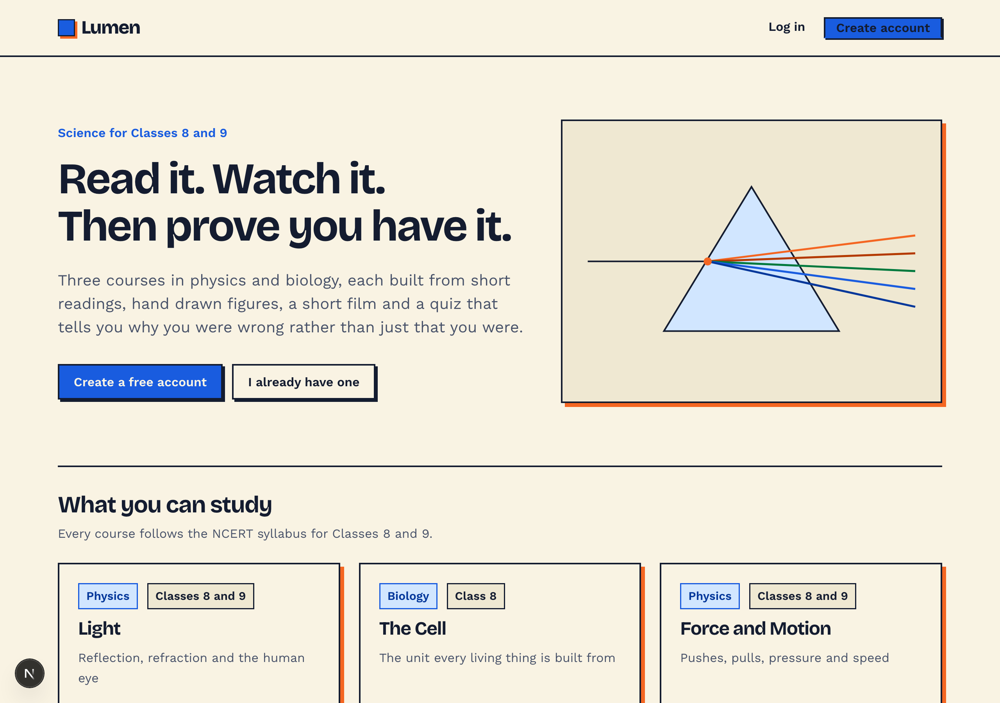
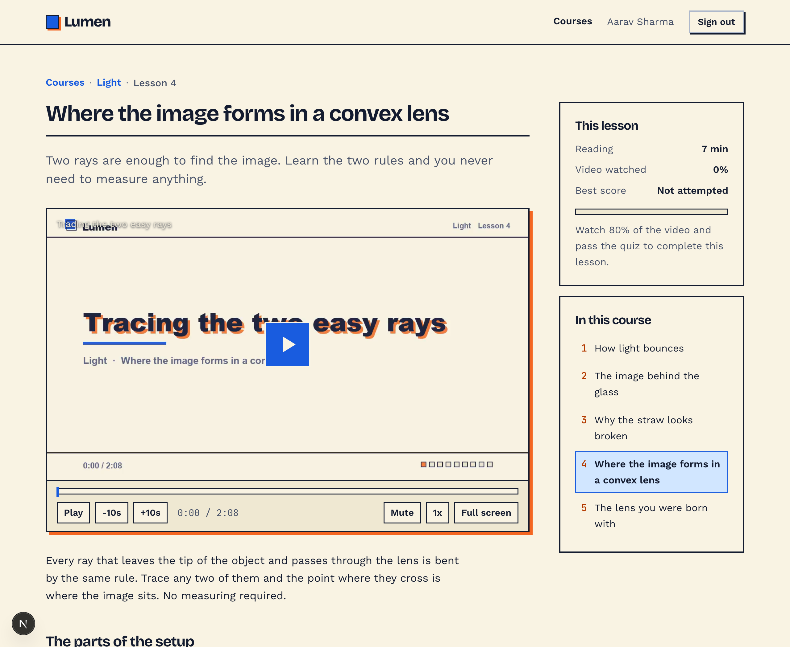
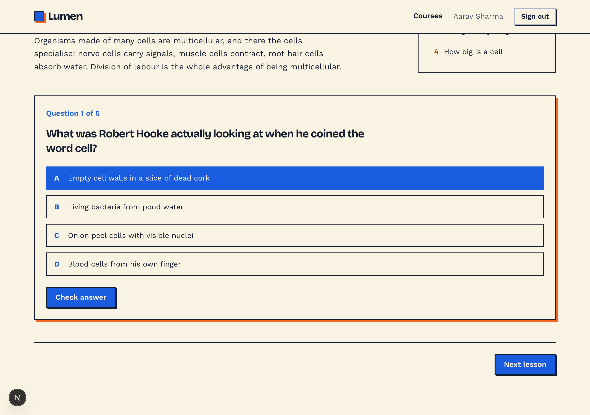
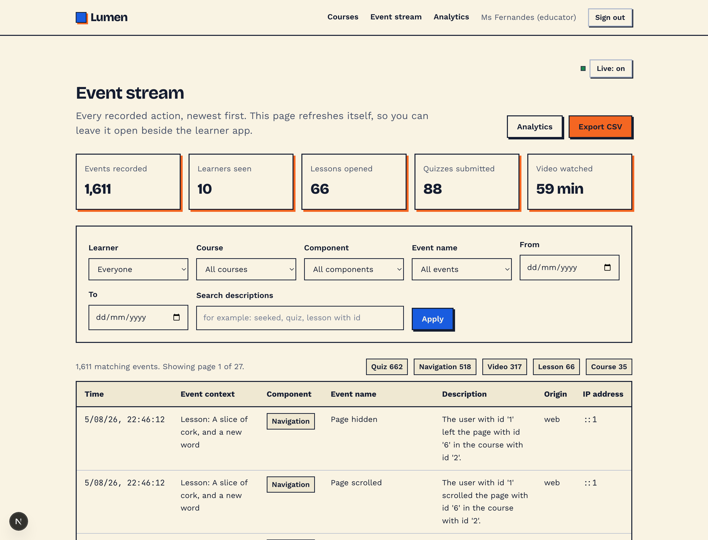
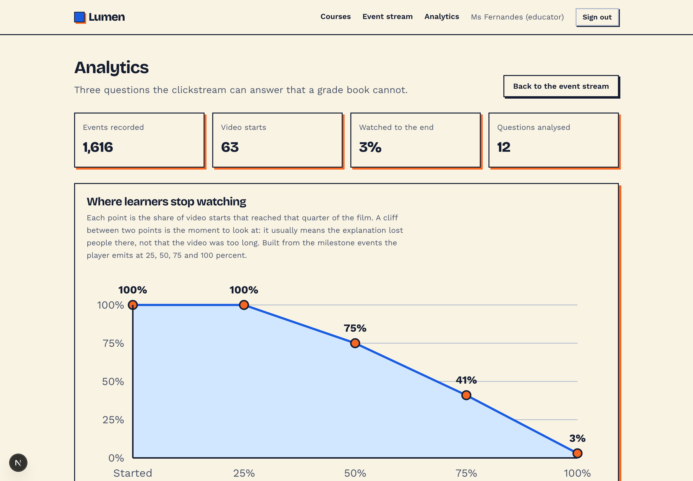
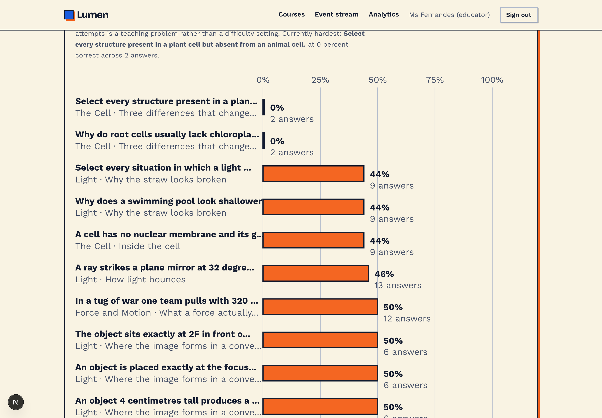
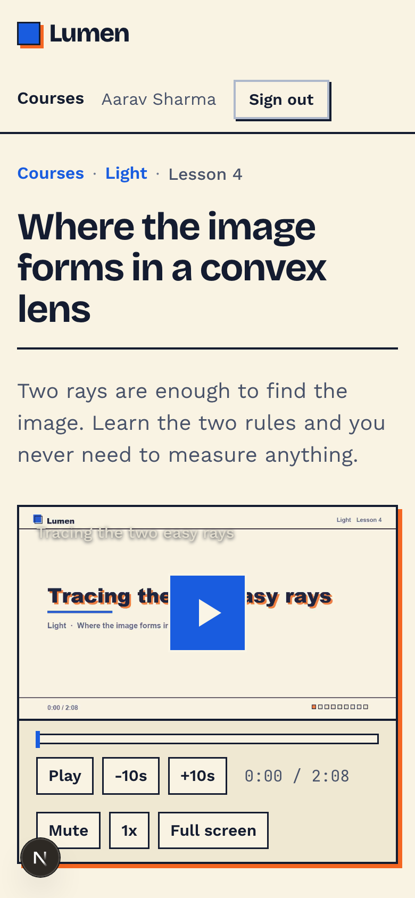

# Lumen

An interactive science learning app for Classes 8 and 9, built around a
complete clickstream: every page view, click, scroll, video action and quiz
answer is captured, stored, and made available to educators as a live event
stream, a CSV export in the standard seven column log format, and three
analytics views.

Three courses, thirteen lessons, seventy questions, and a lesson video for every
lesson.



---

## Contents

- [What it does](#what-it-does)
- [Running it](#running-it)
- [Demonstration accounts](#demonstration-accounts)
- [Suggested demo route](#suggested-demo-route)
- [The clickstream](#the-clickstream)
- [Analytics](#analytics)
- [Architecture](#architecture)
- [Project layout](#project-layout)
- [Design](#design)
- [Scripts](#scripts)
- [Known limits](#known-limits)

---

## What it does

**For learners**

- Sign up or sign in as a learner
- Browse three courses and pick a lesson
- Each lesson combines three kinds of interactive content: **text** with
  hand-drawn figures, a **video** with a custom player, and a **quiz**
- Quizzes offer three question types (single answer, select all that apply, and
  numeric entry), graded on the server, with an explanation shown whether the
  answer was right or wrong
- Unlimited retakes; every attempt is stored separately
- Progress is tracked per lesson and per course

A lesson: text, a hand-drawn figure, the video player, and progress in the rail.



Quizzes grade on the server and explain either way.



**For educators**

- A live **event stream**: every recorded action, newest first, filterable by
  learner, course, component, event name, date range and free text search
- **CSV export** in the exact seven column layout of a Moodle standard log
  report
- Three **analytics** views built from the clickstream: video drop-off, quiz
  item difficulty, and activity over time



---

## Running it

Requirements: Node 20 or newer. Nothing else for the default path.

```bash
npm install
npm run seed
npm run dev
```

Then open http://localhost:3000.

`npm run seed` creates `data/app.db`, applies the schema, loads the three
courses and creates the demonstration accounts. It is safe to re-run: content is
rebuilt, recorded events are kept. Use `npm run seed:fresh` to start completely
over.

The lesson videos are committed to the repository, so nothing else is needed to
get a working demo. To rebuild them after editing lesson content you need Python
with Pillow, plus ffmpeg:

```bash
npm run media
```

To fill the analytics with a body of demonstration activity, start the dev
server and then run:

```bash
npm run simulate
```

---

## Demonstration accounts

The password for every seeded account is `lumen1234`.

| Email | Role |
| --- | --- |
| `aarav@lumen.school` | learner |
| `diya@lumen.school` | learner |
| `kabir@lumen.school` | learner |
| `meera@lumen.school` | learner |
| `teacher@lumen.school` | educator |

You can also create your own learner account from the sign-up page.

---

## Demo

A silent 80 second walkthrough is committed at
[`docs/demo.mp4`](docs/demo.mp4). It is a real screen recording of the running
application, captured by `scripts/make_demo.mjs` driving headless Chrome, and it
covers the catalogue, a lesson, the video player including a seek and a speed
change, the quiz, the event stream filtered to video events, and the analytics.

For a narrated version, [`docs/demo-script.md`](docs/demo-script.md) has a beat
sheet with timings and the exact things worth saying.

## Suggested demo route

Open two browser windows side by side.

1. **Left window**: sign in as `teacher@lumen.school` and open the event stream.
   Leave it there. It refreshes itself every few seconds.
2. **Right window**: sign in as `aarav@lumen.school` in a private window and
   work through a lesson. Open a course, open a lesson, press play, drag the
   scrubber backwards, change the speed, then take the quiz and get one wrong on
   purpose.
3. Watch the left window fill in as you go. Seeks arrive with both endpoints,
   quiz answers arrive with the attempt they belonged to.
4. Press **Export CSV** and open the file. The seven columns match the reference
   log format.
5. Open **Analytics** to see the same data as a drop-off curve, a difficulty
   ranking and an activity histogram.

---

## The clickstream

Everything the brief asks to be tracked is tracked, and the vocabulary is kept
small enough to analyse.

| Component | Events |
| --- | --- |
| **Navigation** | Page viewed, Element clicked, Link followed, Page scrolled, Page hidden, Page shown |
| **Video** | Video started, paused, resumed, seeked, ended, playback rate changed, volume changed, entered and exited fullscreen, buffering started and ended, milestone reached, watch heartbeat |
| **Quiz** | Quiz attempt started, Quiz option selected, Quiz answer cleared, Quiz question answered, Quiz attempt submitted |
| **Lesson** | Lesson viewed |
| **Course** | Course viewed, Course catalogue viewed |
| **User** | User account created, User logged in, User logged out, Login failed |
| **Report** | Event stream viewed, Analytics dashboard viewed, Clickstream exported |

Some details worth calling out:

- **Clicks are captured globally.** The brief names clicks explicitly, so the
  tracker listens on the document in the capture phase rather than relying on
  handlers being added to each element. Untagged elements still produce a usable
  identifier from their tag, id and visible text.
- **Seeks carry both endpoints.** A seek records where the learner jumped from,
  where they jumped to, the direction and the size of the jump. This is only
  possible because the player is self hosted rather than an embed.
- **Identity is resolved on the server.** The browser reports what happened, not
  who did it. A tampered payload cannot forge another learner's activity, and
  the event names the browser is allowed to send are checked against a closed
  list.
- **Events survive navigation.** The queue is batched and flushed with
  `navigator.sendBeacon` on page hide, where a normal request would be
  cancelled.
- **Logging never breaks the lesson.** Every write is wrapped so that a failure
  to record an event cannot interrupt what the learner was doing.

### The seven column projection

Rows are shaped so a Moodle standard log report can be projected straight out of
them. `src/lib/moodle.ts` holds that projection, so the on-screen table and the
CSV can never drift apart.

| Moodle column | Source |
| --- | --- |
| Time | `occurred_at`, rendered as `5/08/26, 09:56:05` |
| Event context | `context`, for example `Lesson: Where the image forms in a convex lens` |
| Component | `component` |
| Event name | `event_name` |
| Description | `description`, written as a sentence naming the actor and the object |
| Origin | `origin` |
| IP address | `ip` |

The stored row carries more than these seven columns (user id, session id,
course and lesson ids, path, user agent, and a JSON `meta` object holding the
event-specific payload). The seven columns are the export shape, not the storage
shape.

---

## Analytics

Three views, each of which answers a question a grade book cannot.



**Where learners stop watching.** The share of video starts that reached each
quarter of the film. A cliff between two points marks the moment an explanation
lost people. Built from the milestone events the player emits at 25, 50, 75 and
100 percent, which is why the player had to be self hosted.



**Which questions are actually hard.** Percentage of recorded answers that were
correct, hardest first. Every attempt counts separately, including retakes, so a
question that stays red after repeated attempts is a teaching problem rather
than a difficulty setting.

**When the work happens.** Events per hour. Useful for seeing whether a class
works during the school day or late at night.

The charts are drawn by hand as SVG rather than pulled from a plotting library.
There are only three, each is a fixed shape, and drawing them keeps them in the
same palette and line weights as the lesson figures.

---

## Architecture

```
Browser                          Server                        SQLite
-------                          ------                        ------
Tracker (global listeners)  ->   POST /api/events         ->   events
VideoPlayer (media events)  ->   POST /api/events         ->   events
                            ->   POST /api/progress/video ->   lesson_progress
Quiz                        ->   POST /api/quiz/start     ->   quiz_attempts
                            ->   POST /api/quiz/answer    ->   quiz_responses + events
                            ->   POST /api/quiz/submit    ->   quiz_attempts + events
Server components           ->   recordEvent()            ->   events

Educator pages              <-   lib/analytics.ts         <-   events, quiz_*
GET /api/events/export      <-   lib/moodle.ts            <-   events
```

**Stack**: Next.js 15 (App Router) with React 19 and TypeScript, SQLite through
`better-sqlite3`, and plain CSS with a custom property token layer. Passwords
are hashed with bcrypt; sessions are opaque tokens in an httpOnly cookie, stored
server side.

**Why SQLite**: the whole application runs from a single file with no service to
provision, which matters for a project whose deliverable is a repository and a
video rather than a deployment. `better-sqlite3` is synchronous, which suits
request handlers that do a handful of small reads.

**Why no chart or component library**: the visual design is specific enough that
a library would have been fought rather than used, and the three charts and
dozen figures are each simple in isolation.

---

## Project layout

```
scripts/
  seed.mjs              creates and loads the database
  content/              the three courses, as plain data
  make_videos.py        renders lesson videos from the lesson content
  simulate.mjs          generates demonstration activity over real endpoints
src/
  app/
    page.tsx            landing
    login/  signup/     authentication screens
    courses/            catalogue, course overview, lesson pages
    educator/           event stream and analytics
    api/                auth, events, quiz and progress endpoints
    globals.css         the design system
  components/
    Tracker.tsx         global clickstream capture
    VideoPlayer.tsx     custom player and its event surface
    Quiz.tsx            question rendering and immediate feedback
    Figures.tsx         the hand-built lesson diagrams
    Charts.tsx          the three analytics charts
  lib/
    schema.sql          database schema
    db.ts               connection and row types
    session.ts          passwords, sessions, request context
    events.ts           the clickstream writer
    moodle.ts           the seven column projection and CSV
    content.ts          course and progress queries
    analytics.ts        the educator queries
docs/
  design.md             the design specification
  demo-script.md        beat sheet for recording a narrated demo
  demo.mp4              silent walkthrough of the running app
  presentation.pptx     the presentation
  screens/              screenshots used in the README and the deck
```

---

## Design

The direction is **Riso Press**: a risograph printed science zine. Two flat spot
colours (blue and orange) on cream stock, a heavy geometric display face,
thick keylines, and hard offset shadows instead of blurs. It targets 13 to 15
year olds, which is old enough that a cartoon mascot would read as
condescending and young enough that a plain document would read as homework.

Rules the stylesheet enforces:

1. Nothing renders below 15px. There is no smaller type token.
2. No uppercase letterspaced micro-labels. Labels are sentence case and say
   something.
3. Every colour is an OKLCH token. No inline colour values.
4. Every interactive element styles all eight states.
5. Motion animates transform and opacity only, and collapses under
   `prefers-reduced-motion`.

Two typefaces do all the work: **Bricolage Grotesque** for headings and
**Work Sans** for everything read. **JetBrains Mono** appears only inside
technical drawings, never as interface chrome.

The lesson figures are drawn to correct geometry rather than sketched. The
convex lens diagram traces a real parallel ray through the far focus and a real
central ray, and they meet where the image actually forms. The cell size chart
is genuinely logarithmic.

It holds up on a phone: no horizontal scroll at 375px, and no clickable label
ever wraps to two lines.



The full specification is in [docs/design.md](docs/design.md).

---

## Scripts

| Command | What it does |
| --- | --- |
| `npm run dev` | Start the development server |
| `npm run build` | Production build |
| `npm run start` | Serve the production build |
| `npm run seed` | Create or refresh the database and content |
| `npm run seed:fresh` | Delete the database and start over |
| `npm run media` | Rebuild the lesson videos (needs Python with Pillow, and ffmpeg) |
| `npm run simulate` | Generate demonstration activity (dev server must be running) |
| `npm run screens` | Recapture the screenshots in `docs/screens` (macOS with Chrome) |
| `npm run deck` | Rebuild `docs/presentation.pptx` with current figures |
| `npm run demo` | Re-record `docs/demo.mp4` (dev server must be running) |

---

## Known limits

Stated plainly, because a project that claims to be finished usually is not.

- **The lesson videos are generated slide films, not filmed explanations.** They
  are built from the lesson's own headings and key points so that each film says
  what its lesson says, and they are real MP4s with real durations so the
  player and the drop-off analytics work on genuine media. They are not a
  substitute for a teacher on camera.
- **`npm run simulate` fabricates timestamps.** It drives the real endpoints, so
  every event passes through the same tracker, grading and logging code a real
  learner would trigger. The one thing it invents is *when*: a final pass
  spreads the events it caused across the previous few days so the activity
  chart has a shape. Real usage is unaffected.
- **SQLite and `better-sqlite3` mean a single node.** Correct for this project,
  wrong for a real deployment with concurrent writers.
- **No email verification and no password reset.** Out of scope.
- **Light theme only.** The design commits to printed cream stock; a dark
  variant would be a different design rather than a toggle.
- **Two transitive build dependencies of Next 15 (postcss and sharp) carry
  published advisories** whose fix requires a Next major upgrade. They affect
  build tooling and image optimisation rather than the running app, and the
  upgrade was judged too risky to take late in the build. `npm audit` reports
  them.

---

Built for a learning analytics assignment. The accounts, the learners and the
activity in the analytics are seeded demonstration data.
